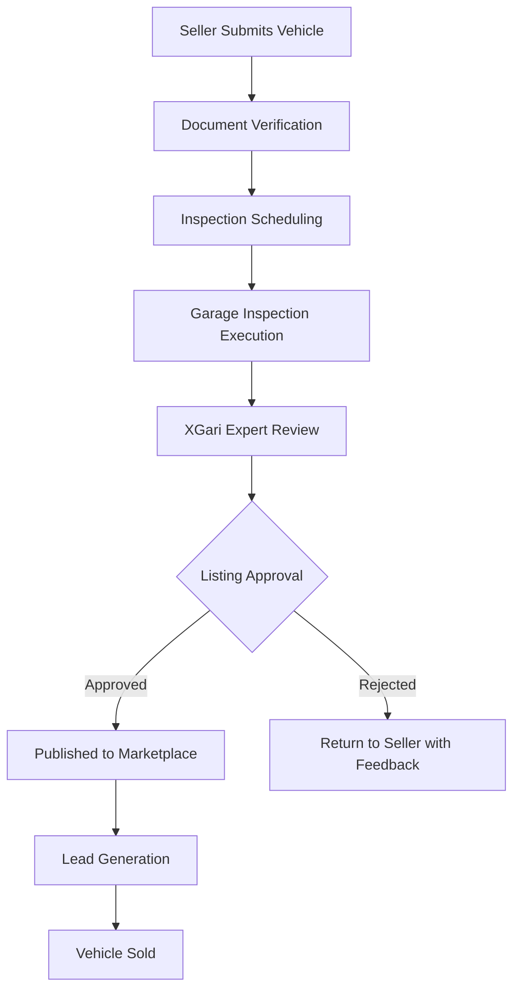
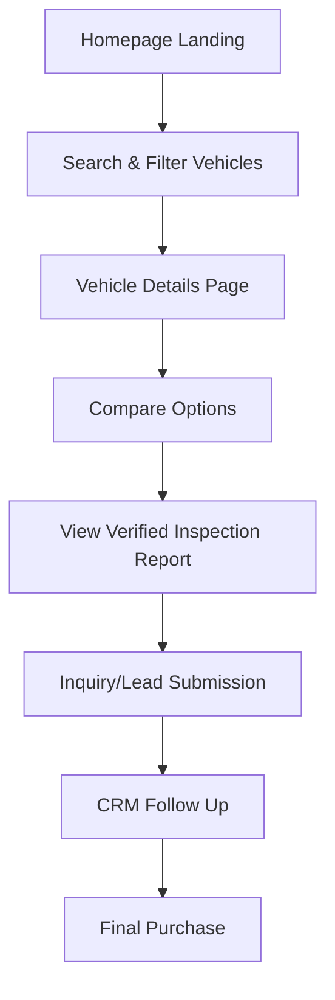

# XGari: Comprehensive UX/UI Design & Product Specification

---

## 1. Product Overview

### What is XGari?
XGari is a comprehensive vehicle marketplace and inspection platform designed to build trust in used vehicle transactions. It connects various stakeholders in the automotive ecosystem through a verified, transparent inspection workflow.

**Key Stakeholders Connect:**
*   Vehicle Sellers (Individuals & Showrooms)
*   Vehicle Buyers
*   Garage Partners
*   Inspection Experts
*   Administrators

### Core Value Proposition
*   **Verified Vehicle Inspections:** Eliminating the guesswork and risk from buying used cars.
*   **Trusted Marketplace:** A secure environment for buyers and sellers to interact.
*   **End-to-End Lifecycle Management:** Handling everything from listing to inspection to final sale.
*   **Integrated CRM & Support:** Ensuring seamless communication and issue resolution.
*   **Robust Partner Ecosystem:** Empowering garages and showrooms with digital tools.

---

## 2. User Personas & Pain Points

Understanding our users is critical for the UI/UX team. Design decisions should be tailored to solve these specific pain points.

### 👤 Vehicle Buyer
*   **Goals:** Find trusted vehicles, compare options easily, access transparent inspection reports, and contact sellers securely.
*   **Pain Points:** Fake listings, hidden vehicle mechanical issues, lack of pricing transparency.
*   **New Features Needed:** Recently viewed vehicles, AI-driven vehicle recommendations, price history charts, EMI calculator, vehicle availability status, and an easy-to-read "Inspection Confidence Score."

### 👤 Vehicle Seller (Individual)
*   **Goals:** Sell their vehicle quickly, get a fair market valuation, and reach a broad audience of serious buyers.
*   **New Features Needed:** Listing performance analytics (view counts, lead counts), easy options to "Boost" listings.

### 🏢 Showroom Partner (Business Seller)
*   **Goals:** Manage bulk inventory, track sales team performance, manage leads, and handle documentation at scale.

### 🛠️ Garage Partner & 🔍 Inspection Expert
*   **Goals:** Receive a steady stream of inspection jobs, easily follow standardized checklists, and submit reports efficiently.
*   **New Features Needed:** Calendar scheduling for inspections, standardized inspection templates, and an **Offline Inspection Mode** (for garages with poor internet connectivity).

### 🛡️ Platform Administrator
*   **Goals:** Maintain platform quality, manage disputes, monitor operational KPIs, and onboard partners.
*   **New Features Needed:** Workflow automation, bulk actions for approvals, notification center, and comprehensive audit timelines for dispute resolution.

---

## 3. Core User Journeys

> [!IMPORTANT]
> Designers must ensure these flows require the minimum number of clicks and provide clear status indicators at every step.

### A. The Vehicle Listing & Inspection Journey (Seller/Expert Flow)

### B. The Buyer Purchase Journey

---

## 4. Information Architecture (Sitemap)

The platform is divided into distinct portals for security and user-focus.

**1. Public Website & Marketplace**
*   Home
*   Search & Filters
*   Vehicle Details
*   Compare Vehicles
*   Saved Vehicles / Watchlist
*   Contact / Support

**2. Customer Portal (Logged in Buyers/Sellers)**
*   Dashboard
*   Saved Vehicles & Searches
*   Active Inquiries & Leads
*   Inspection Reports
*   Support Tickets

**3. Garage Portal**
*   Active Jobs & Calendar
*   Inspection Checklists
*   Photo/Video Uploads
*   Inspection History & Earnings

**4. XGari Expert Portal**
*   Pending Inspections for Review
*   Detailed Quality Checklist
*   Approval/Rejection Submission
*   Review History

**5. Showroom Portal**
*   Bulk Inventory Management
*   Active/Draft Listings
*   Revenue & Sales Analytics
*   Document Vault

**6. Admin Portal**
*   Vehicles (All Statuses)
*   Inspections Oversight
*   Lead Distribution Management
*   Partner Onboarding (Garages/Showrooms)
*   Support & Ticketing
*   User Management
*   Platform Analytics

---

## 5. UI/UX Component Library Guidelines

> [!TIP]
> The UI team should build a unified Design System using these foundational elements to ensure consistency across all portals.

*   **Buttons:**
    *   *Primary:* Call to actions (e.g., "Book Inspection", "Contact Seller").
    *   *Secondary:* Alternative actions (e.g., "Save for Later").
    *   *Outline:* Filters and toggles.
    *   *Danger:* Destructive actions (e.g., "Delete Listing").
*   **Cards:**
    *   *Vehicle Card:* Must include Thumbnail, Title, Price, Key Specs (Mileage, Year), and the **Inspection Confidence Score**.
    *   *Lead Card (Admin/Showroom):* Buyer name, contact info, vehicle of interest, status timeline.
    *   *Inspection Card (Garage):* Vehicle make/model, scheduled time, location, status.
*   **Tables:**
    *   Designed for Admin and Showroom portals. Must include sorting, filtering, bulk actions, and pagination.
*   **Forms:**
    *   Complex forms (like Vehicle Submission) must be broken down into multi-step wizards with progress bars.

---

## 6. Key Screen Wireframe Specifications

### A. Public Homepage
*   **Hero Section:** High-converting search bar (Make, Model, Budget).
*   **Featured Vehicles:** Carousel of highly-rated, recently inspected cars.
*   **Trust Section:** "Inspection Benefits" and "How It Works" infographics.
*   **Garage Network:** Map or list showcasing partnered garages to build local trust.
*   **Social Proof:** Video or text testimonials from buyers and sellers.

### B. Search Results Page
*   **Layout:** Interactive Map View alongside a Grid View of vehicle cards.
*   **Advanced Filters:** Make, Model, Year, Price, Mileage, Fuel Type, Transmission, and **Inspection Score Range**.
*   **Tools:** "Save Search" alert button and Sort Controls (Price, Newest, Best Inspected).

### C. Vehicle Details Page (VDP)
*   **Media:** High-res image gallery and optional 360-degree view.
*   **Hero Info:** Price, Make/Model, Year, and prominently displayed **Inspection Confidence Score** (e.g., 9.5/10).
*   **Core Tabs:**
    1.  Vehicle Specs
    2.  Detailed Inspection Report (Downloadable PDF or interactive checklist)
    3.  Price History Chart *(New Feature)*
    4.  EMI Calculator *(New Feature)*
*   **Conversion:** Sticky "Contact Seller" or "Book Test Drive" inquiry form.
*   **Footer:** "Similar Vehicles" recommendation engine.

### D. Admin Dashboard (Analytics)
*   **KPI Cards (Top Row):** Total Active Listings, Pending Inspections, Active Leads, Sold Vehicles, Revenue, Open Support Tickets.
*   **Charts & Graphs:**
    *   Listing Growth over time (Line chart).
    *   Lead Funnel (Bar or Funnel chart: View -> Inquiry -> Sale).
    *   Inspection Performance (Garages completing tasks on time).

---

## 7. Action Items for the UI/UX Team

Please implement the following based on this spec:
1.  **Moodboard & Style Guide:** Develop a color palette that screams "Trust, Transparency, and Premium Automotive." Include modern typography.
2.  **Interactive Prototypes:** Focus first on the **Buyer Search -> Vehicle Details** flow and the **Garage Inspection -> Submission** flow, as these are the core platform differentiators.
3.  **Mobile-First Approach:** The Buyer Journey and the Garage Portal (Checklists/Photo uploads) MUST be designed mobile-first.
4.  **Incorporate Missing Features:** Ensure all features listed in the "New Features Needed" sections (under Personas) are visible in the wireframes.

---

